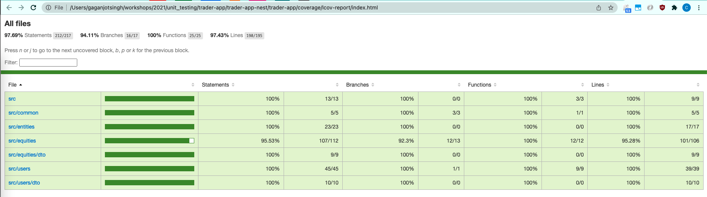

## Clone repository
```bash
git clone https://github.com/gaganshera/testing-poc.git
cd testing-poc
```

## Prerequitites for running the app
- Nodejs >= 10
- npm (bundles with nodejs)
- MySQL

## Installation

```bash
$ npm install
```

## MySQL configurations
- Create a database named `traders` in your MySQL server
- Modify MySQL username, password, host, etc in `ormconfig.json`
- Run migrations
```bash
$ npm run migration:run
```

## Running the app

```bash
$ npm run start
# watch mode
$ npm run start:dev

# localhost:3000 => Hello World!
```

## Test

### Unit tests + narrow integration tests
- Dependencies: sqlite3 installed on machine
```bash
# unit tests + narrow integration tests
$ npm run test
```

### E2E broad integration tests
- Dependencies: MySQL installed on machine
- Create a database named `traders-2` in your MySQL server
- Change MySQL config in `test-broad-integration/config.ts`
```bash
# e2e broad integration tests
$ npm run test:e2e
```

### Test Coverage Report
```bash
# test coverage
$ npm run test:cov
```
Coverage report html path: `/coverage/lcov-report/index.html`


## APIs

- Get all users
```
curl --location --request GET 'localhost:3000/users'
```

- Create user
```
curl --location --request POST 'localhost:3000/users' \
--header 'Content-Type: application/json' \
--data-raw '{"name": "User 4", "funds": 200}'
```

- Get all equities
```
curl --location --request GET 'localhost:3000/equities'
```

- Create equity
```
curl --location --request POST 'localhost:3000/equities' \
--header 'Content-Type: application/json' \
--data-raw '{"name": "Equity 4", "units": 330, "cost": 10}'
```

- Buy equity (POST equities/buy/:equityId)
```
curl --location --request POST 'localhost:3000/equities/buy/fc4e62b6-db1d-4f8b-bdd6-6d4067b0f9b9' \
--header 'Content-Type: application/json' \
--data-raw '{"units": 2, "user_id": "204cb644-697a-4a2b-b907-8145ed3f01eb"}'
```

- Sell equity (POST equities/buy/:equityId)
```
curl --location --request POST 'localhost:3000/equities/sell/fc4e62b6-db1d-4f8b-bdd6-6d4067b0f9b9' \
--header 'Content-Type: application/json' \
--data-raw '{"units": 2, "user_id": "204cb644-697a-4a2b-b907-8145ed3f01eb"}'
```

- Add funds (POST users/addFunds/:userId)
```
curl --location --request POST 'localhost:3000/users/addFunds/54e237f4-7a0c-43fa-9158-d3bf6d6c224b' \
--header 'Content-Type: application/json' \
--data-raw '{"funds": 100}'
```
